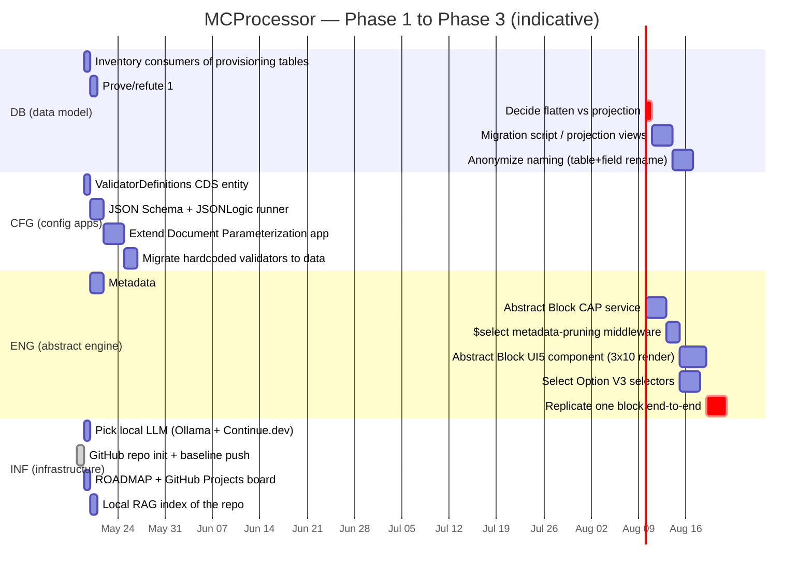

# MCProcessor Roadmap

Single source of truth for direction and sequencing. Updated only when scope changes are decided.

## Vision

Transform the imported "Internal Projects" baseline into a **domain-agnostic abstract process engine** where new business processes are added by configuration. Eventually exposed as an MCP (Model Context Protocol) server so AI agents can drive workflows.

## Tracks

Four parallel work tracks. Tasks within a track are sequential; tracks themselves can progress in parallel where dependencies allow.

## Architectural pillars (must hold throughout)

1. **Metadata-driven, not column-wide.** Block fields live in `FieldDefinitions` + `BlockFieldValues` (EAV-style), not 300-wide tables.
2. **Validators as data.** JSON Schema (shape) + JSONLogic (cross-field). No embedded JS sandboxes.
3. **Backend-authoritative.** UI may enforce, backend must enforce. Validators run both sides.
4. **Anonymize before extending.** Phase 2 renames precede Phase 3 features; never the other way.
5. **Slow is smooth.** Validation, tests, and review gates over throughput.

## Phases

| Phase | Outcome | Tracks involved | Status |
|---|---|---|---|
| **0** | Baseline imported, repo + tooling established | INF | ✅ done |
| **1** | Database flattened (1:1 merges), validators parameterized, document-param app extended | DB · CFG | not started |
| **2** | Domain-neutral: anonymized names, Abstract Block component, 10×10×30 matrix metadata, query optimization | DB · CFG · ENG | not started |
| **3** | Field Control per-block parameterization, unified shell navigation, Select Option V3 selectors | CFG · ENG | not started |
| **4** | Local LLM (Ollama + Continue.dev) for repetitive coding; MCProcessor exposed as MCP server | INF | not started |
| **5** | Cross-platform vision: S/4HANA (ABAP) and OutSystems adapters; cross-process comparison via shared meta-model | DB · ENG | not started |

## Immediate next actions (post-baseline)

1. **DB-1** — `git grep` consumers of `RequestProvision` / `BlockProvisioning` in the imported tree
2. **CFG-1** — Draft `ValidatorDefinitions` CDS entity and discuss with reviewer before commit
3. **INF-1** — `winget install Ollama.Ollama`, pull `qwen2.5-coder:7b-instruct-q4_K_M`, wire Continue.dev to it
4. **INF-3** — Open a GitHub Projects board on this repo, seed it from this Gantt

## Open architectural questions

- EAV vs. JSON-column for `BlockFieldValues` value storage (lean toward EAV with typed value columns)
- Validator UX: dedicated app or extend existing Document Parameterization?
- Selector V3 schema spec — borrow from existing `SelectOption` table or redesign?
- MCP transport choice: stdio vs. SSE for the eventual MCP server

These are tracked as issues once the GitHub Projects board exists.
